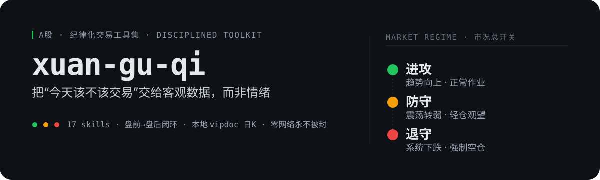
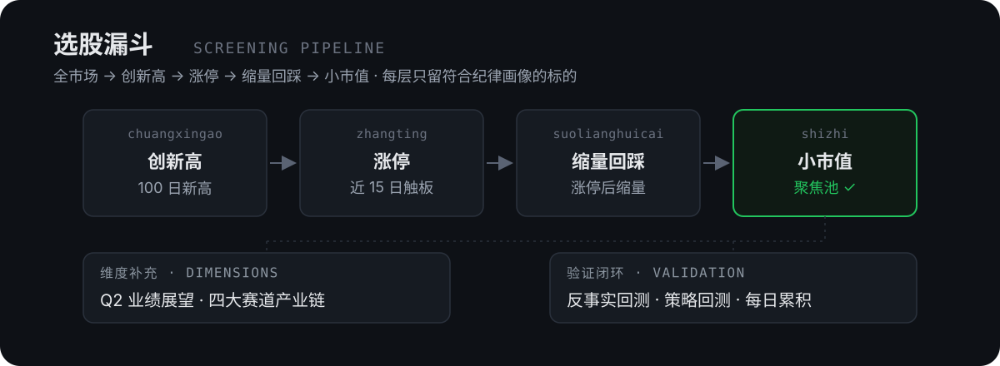

<p align="center">
  
</p>

> **不预测涨跌，只做"信号触发才动手"的应对。** 这是一套跑在 [Claude Code](https://docs.claude.com/en/docs/claude-code) 里的 A 股工具集——17 个 skill + 几个底层 Python 脚本，用客观数据信号回答两个问题：**今天该不该交易？该交易时买什么？**

---

## 它要解决什么

大多数散户的亏损，往往不来自"不会选股"，而来自**会选股、但没纪律**：

- 大盘已经走弱，还在硬干——**该空仓时没空仓**
- 一跌就补仓摊平，把短线做成深套——**用加码掩盖止损缺席**
- 看到涨停就追、连亏就加注——**情绪代替了画像**
- 复盘靠记忆，凭感觉——**没有可勾选的标准**

`xuan-gu-qi` 把"纪律"装回程序。它**不替你做决定**，而是把市况、主线、选股、账户纪律全部变成可读的客观数据，让交易冲动在发生前就被一道信号拦下。

> 项目的起点是一个被实测诊断为"**会做交易、只是没纪律**"的真实账户：过度交易、补仓摊平、不止损。整套工具就是围绕"少交易 + 严纪律"重建的——**克制是它的第一性**，不是助长更多交易。

---

## 核心：一个市况状态机 + 盘前→盘后闭环

整个体系的总开关是 **市况判断（`market_regime`）**。它把大盘压缩成一个三态信号，决定"今天该不该动手"：

| 状态 | 条件 | 动作 |
| :---: | :--- | :--- |
| 🟢 **进攻** | 三大指数趋势分 + 市场宽度合计 ≥ +4 | 趋势向上，正常作业 |
| 🟡 **防守** | 得分 −3 ~ +3 | 震荡转弱，轻仓观望 |
| 🔴 **退守** | 得分 ≤ −4 | 系统性下跌，**强制空仓** |

> 退守市是绝大多数大亏发生的地方。这条铁律写在复盘 skill 里：**退守市强制空仓**，没有例外。

围绕这个总开关，工具按时段形成闭环：

| 时段 | 工具 | 做什么 | 方向 |
| :--- | :--- | :--- | :---: |
| 盘前 07:30–09:00 | [`panqian`](./.claude/skills/panqian) | 外部温度计：美股 / A50 期货 / 中概 / 汇率 / 大宗 / 国际新闻 | 向外·全球 |
| 盘中 / 盘后 | `market_regime` | 市况总开关 🟢🟡🔴，决定今天该不该交易 | 向内·大盘 |
| 盘后 | [`fupan`](./.claude/skills/fupan) | 高手复盘 5 步 → 「次日剧本」三套应对预案 | 向外·境内 |
| 周末 | `trade_review.py` | 盯账户纪律：补仓 / 大单 / 胜率 / 盈亏比红绿灯 | 向内·账户 |

`fupan` 显式对照 `panqian` 的隔夜信号（"预报 vs 实况"），把市场复盘与账户复盘分开——**向外看市场，向内盯自己**。

---

## 选股：四步漏斗 + 维度补充 + 回测验证

<p align="center">
  
</p>

选股是一条**纪律画像驱动的漏斗**——每一层只保留符合"趋势 + 资金 + 回踩 + 弹性"的标的，而不是靠单一指标一把梭。`qsht-agent` 把整条链一键串起来（默认 10–25 分钟跑完全市场）。

- **维度补充**：[`q2zhanwang`](./.claude/skills/q2zhanwang) 用一季报"加速度"推断 Q2 走向；[`sidasaidao`](./.claude/skills/sidasaidao) 把个股映射到**四大赛道**（大工业 / 大能源 / 光和电子 / AI 硬件和基础设施）的产业链上下游。
- **验证闭环**：不靠感觉，靠回测。`backtest_strategy.py` 做反事实画像回测（只过滤"不符合纪律"的交易，量化"只做对的事"的理论收益）；`chaodiefantan` 自带完整策略回测；`qsht-agent` 每日累积缩量回踩样本。

> 给单只股票做定点体检，用 [`eval-stock`](./.claude/skills/eval-stock)——跑 7 个维度（趋势新高 / 近期涨停 / 缩量回踩 / 市值 / Q2 / 四大赛道 / 承接），秒级出达标判定。它和 `qsht-agent` 互补：**广撒网 vs 定点体检**。

---

## 为什么不一样

**🚦 市况优先，不是选股优先。** 先判断"今天该不该交易"，再谈"买什么"。退守市强制空仓，把交易冲动用一道客观数字信号拦在前面。

**💽 本地 vipdoc 日K源，零网络永不被封。** 直读招商证券 / 通达信本地 `.day` 二进制文件（`scripts/local_kline.py`），不依赖东财 / 腾讯等网络接口——后者频繁被 WAF 封、返回脏数据。数据源降级链是 **本地 vipdoc → 东财 → 新浪**，本地优先。
> 局限已诚实标注：`.day` 是**不复权**价，除权会让 K 线跳空。所以指数 / 短期形态 / 当日量能用本地；跨季新高 / 长期趋势 / 回测要前复权，走新浪。可设 `$VIPDOC_DIR` 指向你的客户端目录。

**🧭 四大赛道产业链图谱。** 选股不止看技术面，还看个股在**大工业 / 大能源 / 光和电子 / AI 硬件**四条主线里的位置和上下游关系——这是仓库自有的产业视角。

**🔬 反事实回测，不自我欺骗。** 回测不是"我的策略多赚钱"，而是"如果当初只做符合画像的交易，能避开多少亏损"——直面纪律缺失的真实代价。

---

## 工具矩阵

> 带 `*` 的是 `scripts/` 下的 Python CLI，其余为 Claude Code skill（在 session 里输入 `/<名字>` 触发）。

| 职能 | 工具 | 一句话 |
| :--- | :--- | :--- |
| **主编排** | [`qsht-agent`](./.claude/skills/qsht-agent) | 一键跑漏斗 + Q2 + 回踩复盘，全市场扫描 |
| | [`eval-stock`](./.claude/skills/eval-stock) | 单股 7 维定点体检 |
| **盘前·盘后闭环** | [`panqian`](./.claude/skills/panqian) | 盘前外部温度计 |
| | [`fupan`](./.claude/skills/fupan) | 盘后复盘 → 次日剧本 |
| | `market_regime`* | 市况总开关 🟢🟡🔴 |
| | `trade_review.py`* | 账户纪律红绿灯 |
| **选股漏斗** | [`chuangxingao`](./.claude/skills/chuangxingao) | 100 日新高全市场扫描 |
| | [`zhangting`](./.claude/skills/zhangting) | 近 15 日涨停（板块分阈值） |
| | [`suolianghuicai`](./.claude/skills/suolianghuicai) | 涨停后缩量回踩 |
| | [`shizhi`](./.claude/skills/shizhi) | 市值筛选（小盘弹性） |
| | [`qibao`](./.claude/skills/qibao) | 起爆点（布林上轨 + 倍量 + MACD 水上金叉） |
| **维度补充** | [`q2zhanwang`](./.claude/skills/q2zhanwang) | Q2 业绩展望（加速度信号） |
| | [`sidasaidao`](./.claude/skills/sidasaidao) | 四大赛道查询（产业链） |
| **情境择时** | [`kangdie`](./.claude/skills/kangdie) | 大跌时抗跌池（只看不动） |
| | [`youcehuicai`](./.claude/skills/youcehuicai) | 企稳时右侧趋势回踩 |
| | [`chaodiefantan`](./.claude/skills/chaodiefantan) | 超跌反弹（左侧 + 严止损，含回测） |
| **主线·情绪·事件** | [`zhuxian`](./.claude/skills/zhuxian) | 主线板块 Top 10 |
| | [`renqibang`](./.claude/skills/renqibang) | 东财股吧人气榜（情绪参考） |
| | [`zhongbaoyubao`](./.claude/skills/zhongbaoyubao) | 中报预增事件跟踪 |

---

## 怎么用

**最短路径**（推荐）——用 Claude Code skill：

```bash
# 1. clone
git clone https://github.com/biggodCheng/xuan-gu-qi.git
cd xuan-gu-qi

# 2. 在仓库目录启动 Claude Code
claude

# 3. 在 session 里直接触发 skill（任选）
/fupan          # 今天该不该交易？→ 市况 + 次日剧本
/qsht-agent     # 全市场跑一遍选股漏斗
/eval-stock 600519   # 给某只股票做 7 维定点体检
/panqian        # 盘前看隔夜外部信号
```

**底层 Python 脚本**（`scripts/`，需 Python 3 + `pandas` / `numpy`，各 skill 完整依赖见其 `SKILL.md`）：

```bash
python scripts/market_regime.py     # 单独看市况三态
python scripts/trade_review.py      # 账户纪律周复盘
```

> 想用本地 vipdoc 日K源，设 `$VIPDOC_DIR` 指向通达信 / 招商证券客户端的 `vipdoc` 目录即可；不设则自动降级到网络源。

---

## 边界与免责

- **不预测涨跌。** 所有工具只陈列客观事实与历史经验映射，产出的是"信号触发才动手"的应对预案，不是涨跌预测。
- **不构成任何投资建议。** 仓库内容仅为个人交易纪律化的工具实践与信号参考，盈亏自负。
- **本地 vipdoc 不复权。** 跨季新高 / 长期趋势 / 回测请用前复权源（新浪），详见 [`local_kline.py`](./scripts/local_kline.py)。
- **四大赛道不覆盖医药。** 医药主线用管线 / BD / 医保逻辑，不套涨停回踩框架。

---

## 致谢

高手复盘 5 步框架，参考自公众号「木头婉」的选股复盘思路；本仓库将其偏经验化的表述，落地为一套可勾选、可量化、可回测的标准。所有选股 / 复盘逻辑的工程化实现与代码均为本项目原创。

---

<sub>用客观数据拿信号，把脑力留给主观研判。少交易，严纪律。</sub>
